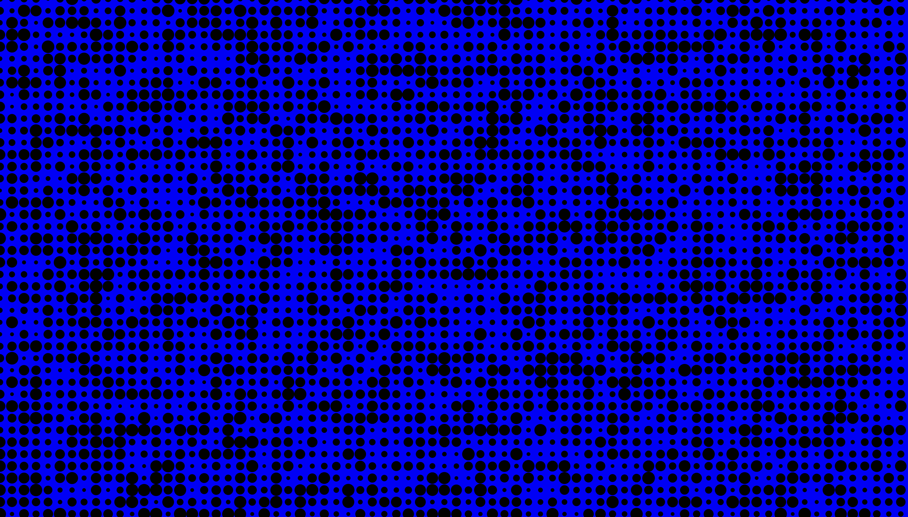
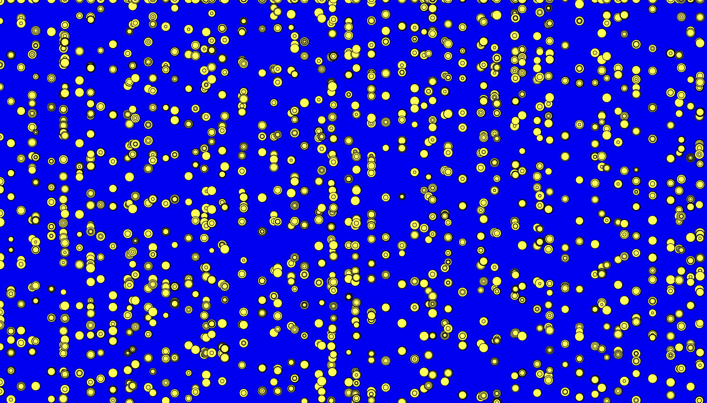
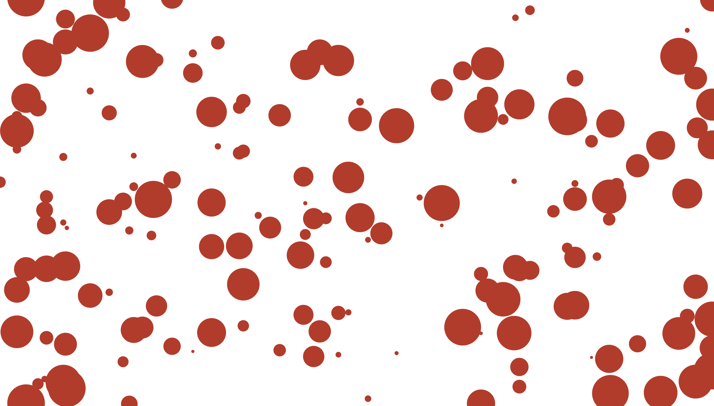
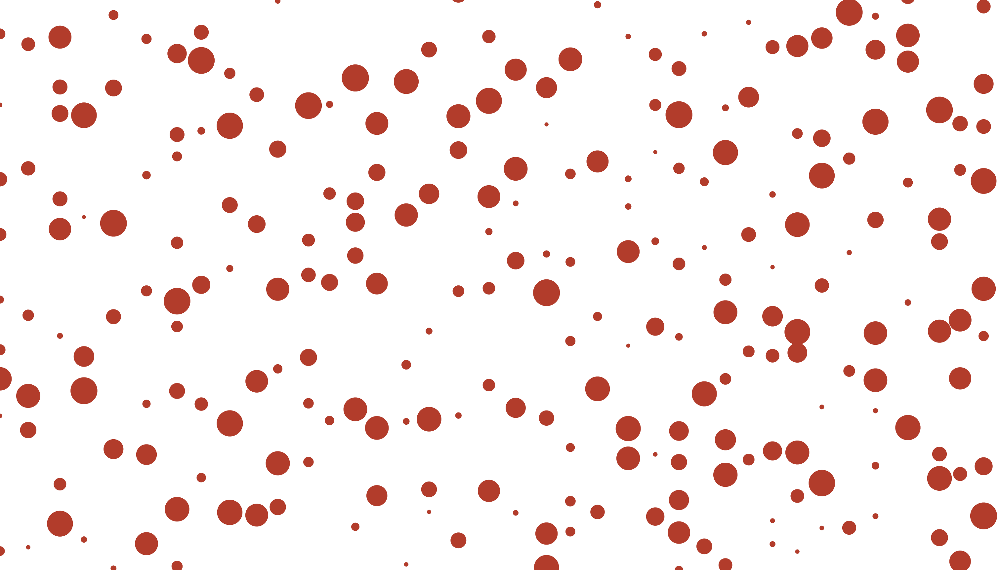

# Thinking first
The requirements:
1. multiple (two or three) sizes of ellipses
2. non-overlapping shapes
3. not in straight lines

I'll start by drawing one set of random circles of random sizes. 
Wait, having random-size circles is easy (by using random). What's difficult is the different-position pieces and not overlapping. Let me try out how to make that happen first. I'll write a for loop. 

Image on repo:  


Wow, it's not random enough. 

# 1st experiment
I began experimenting with xyz of the for loop a bit, given I'm a little lost in the class notes. At last, I picked up how to use random to give random x & y pisitions for points. It now looks like:

Image on repo:  



# 2nd adjustments
Now, I want to try to customize the points. 
I made parameters that are larger and easy to manipulate, and changed the colors and stuffs. 
Image on repo:  


Now I met the #1 and #3 requirements.
Let me think of how to make sure the points don't overlap. I think the logic is: If the distance is controlled, they will be fine. 
I uplift the minimal range for random to 30 for both xpos and ypos. I adjusted this number based on observation of whether there are circles touching each other and on what direction. Here's my final composition:

Image on repo:  



For improvement, I want to make the dots bigger but closer without overlaping, but that seems like a lot to consider in the logic. 


This is a README file that can be used to describe and document your assignment.


Markdown Cheatsheet (from [https://www.markdownguide.org/cheat-sheet/](https://www.markdownguide.org/cheat-sheet/)):

---
---

# Heading1
## Heading2
### Heading3
#### Heading4
##### Heading5
###### Heading6

**bold text**

*italicized text*

~~strikethrough text~~

Ordered List:
1. First item
2. Second item
3. Third item

Unordered List:
- First item
- Second item
- Third item

`short code block`

```
extended code block
fun() {
  return 0
}
```

Link:  
[linked text](https://www.example.com)


Image with url:  


Image on repo:  


To start a new line, add two spaces at the end of a line, like this:  
this is a new line.


To start a new paragraph, leave an empty line between two lines of text.

This is a new paragraph.
